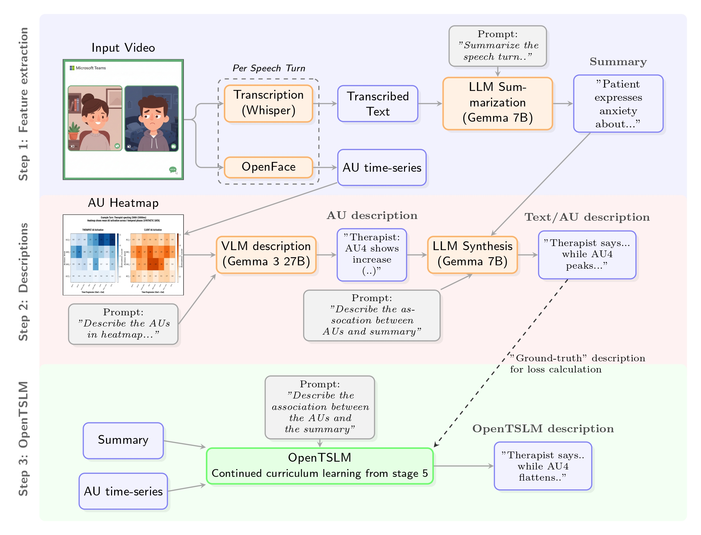

# PsyTSLM: Bridging the Gap Between the Verbal and Non-Verbal in Psychology
It is widely accepted that human non-verbal behavior is inextricably tied to the context in which it is expressed, however, tools to extract context in combination with non-verbal behavior are absent. In this contribution, we focus on the use-case of client and therapist non-verbal behavior in psychotherapy, an incredibly rewarding and fascinating relational setting. We propose PsyTSLM, an end-to-end architecture, that outputs a description in natural language of the salient facial movements combined with a summary of what was said across all speech turns during a treatment session. While we focus on the case of psychotherapy, the architecture is applicable to any instance of dyadic interaction.

We extend the original [openTSLM paper](https://arxiv.org/abs/2510.02410) to fit our use-case.

